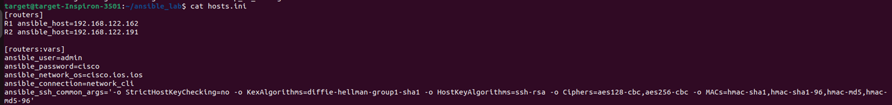
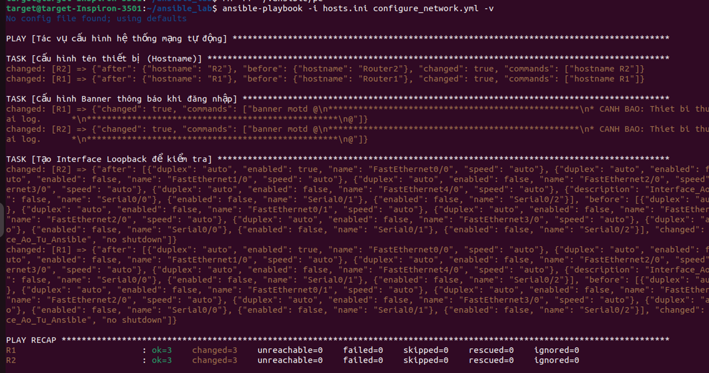
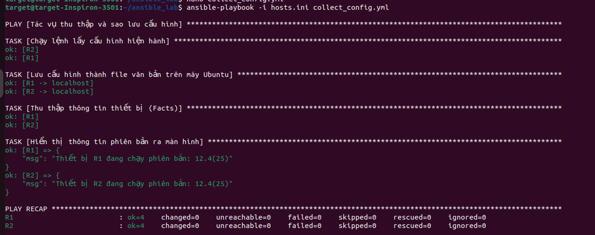

# Ansible-Network-Automation
Tự động hóa cấu hình thiết bị mạng sử dụng Ansible, giúp triển khai nhanh, đồng nhất và giảm lỗi thủ công trong quản lý hạ tầng.

## 1. Mô hình và các thành phần trong mô hình

Dựa trên tệp kiểm kê (`hosts.ini`) và các kịch bản, mô hình mạng gồm các thành phần sau:
- **Máy quản trị (Control Node):** Máy trạm cài đặt Ansible, đóng vai trò điều khiển, cấu hình và thu thập dữ liệu tự động.
- **Thiết bị mạng (Managed Nodes):** Nhóm thiết bị gồm 2 Router chạy hệ điều hành Cisco IOS (có thể chạy qua giả lập GNS3, EVE-NG hoặc đồ thật):
  - **Router1**: IP `192.168.122.162`
  - **Router2**: IP `192.168.122.191`
- **Giao thức kết nối:** Ansible kết nối trực tiếp đến các Router thông qua SSH (`ansible_connection=network_cli`), sử dụng thông tin đăng nhập được khai báo sẵn (`admin` / `cisco`).

## 2. Cách thức tạo các tác vụ cấu hình
Các tác vụ cấu hình được định nghĩa bằng ngôn ngữ YAML trong file playbook `configure_network.yml`. Trình tự thực hiện bao gồm:

1. **Thiết lập kết nối:** Chỉ định nhóm thiết bị mục tiêu (`hosts: routers`) và tắt `gather_facts` để tối ưu thời gian.
2. **Sử dụng các Module của Cisco IOS để thực thi:**
   - **Đổi tên thiết bị:** Sử dụng module `cisco.ios.ios_hostname` để gán tên thiết bị theo biến môi trường `inventory_hostname`.
   - **Cấu hình Banner:** Dùng module `cisco.ios.ios_banner` thiết lập thông báo MOTD với nội dung cảnh báo tùy chỉnh (thuộc quản lý của Team UIT), hiển thị khi có người dùng truy cập.
   - **Tạo Interface:** Dùng module `cisco.ios.ios_interfaces` để tự động tạo một giao diện ảo `Loopback100` với dòng mô tả (`description`) là "Interface_Ao_Tu_Ansible" và đảm bảo giao diện luôn bật (`enabled: true`).

## 3. Cách thức thu thập cấu hình
Việc thu thập cấu hình được tự động hóa qua playbook `collect_config.yml` theo cách sau:

1. **Lấy cấu hình hiện hành:** Dùng module `cisco.ios.ios_command` gửi lệnh `show running-config` tới các router và lưu kết quả vào biến `config_data`.
2. **Sao lưu thành file (Backup):** Chạy module `copy` (thực thi trên máy quản trị - `delegate_to: localhost`) để trích xuất nội dung `config_data` và lưu thành các file văn bản (Ví dụ: `backup_Router1_config.txt`, `backup_Router2_config.txt`).
3. **Lấy thông tin hệ thống (Facts):** Dùng module `cisco.ios.ios_facts` lấy các dữ liệu phần cứng/phần mềm.
4. **Hiển thị phiên bản:** Dùng module `debug` in ra màn hình phiên bản hệ điều hành (`ansible_net_version`) hiện tại của mỗi Router để người quản trị dễ dàng theo dõi.

## 4. Giải thích kết quả đạt được sau khi sử dụng Ansible
Sau khi thực thi các Playbook, ta thấy rõ các kết quả sau trên toàn bộ mô hình:
- **Tự động hóa thành công không cần can thiệp thủ công:** Thông qua file kết quả sao lưu, ta có thể thấy các cấu hình đã được áp dụng chính xác cho cả 2 Router (tạo thành công `Loopback100`, thiết lập `banner motd`, v.v.). Việc này diễn ra đồng thời, tiết kiệm được rất nhiều thời gian so với gõ từng dòng lệnh CLI truyền thống.
- **Tính đồng nhất cấu hình:** Cả Router1 và Router2 đều có cấu trúc Banner và mô tả Interface giống hệt nhau, loại bỏ hoàn toàn các lỗi cú pháp thường gặp do con người gây ra (human error).
- **Sao lưu tập trung, dễ quản lý:** Các file cấu hình (`backup_Router1_config.txt`, `backup_Router2_config.txt`) được tự động gom về lưu trữ an toàn trên Control Node, phục vụ cho quá trình kiểm tra (audit) mạng hoặc phục hồi hệ thống nhanh chóng khi có sự cố mạng xảy ra.
